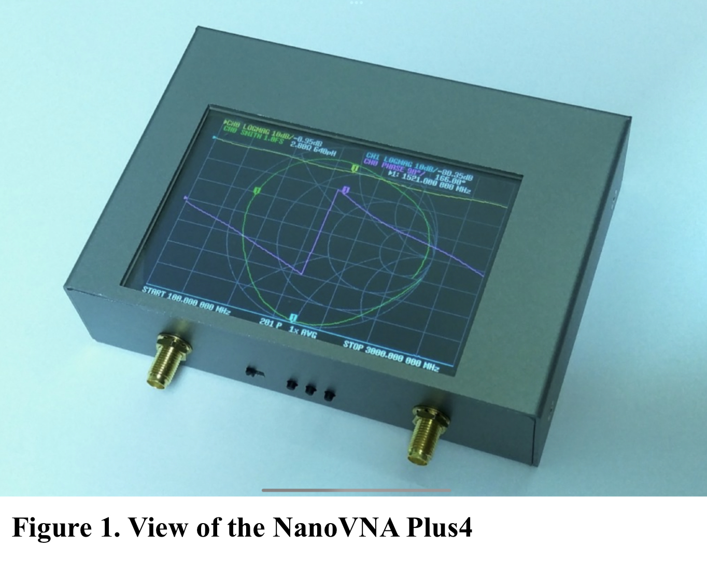
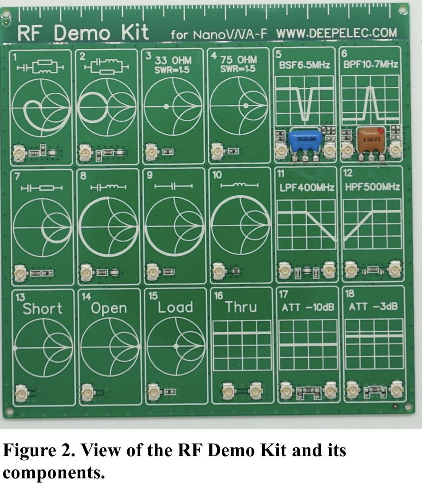
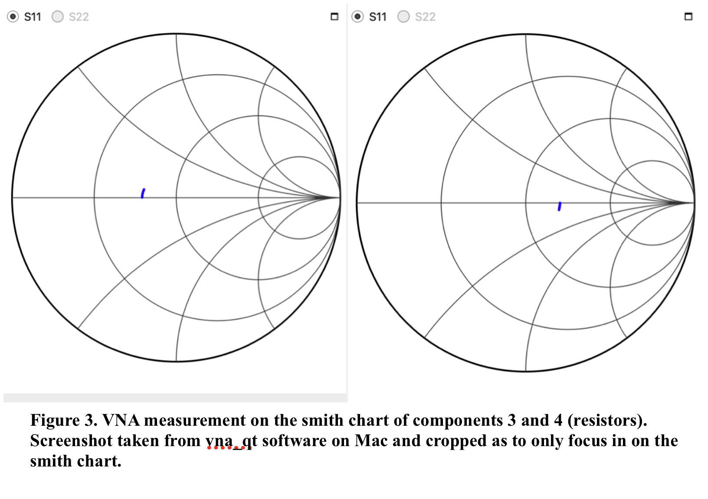
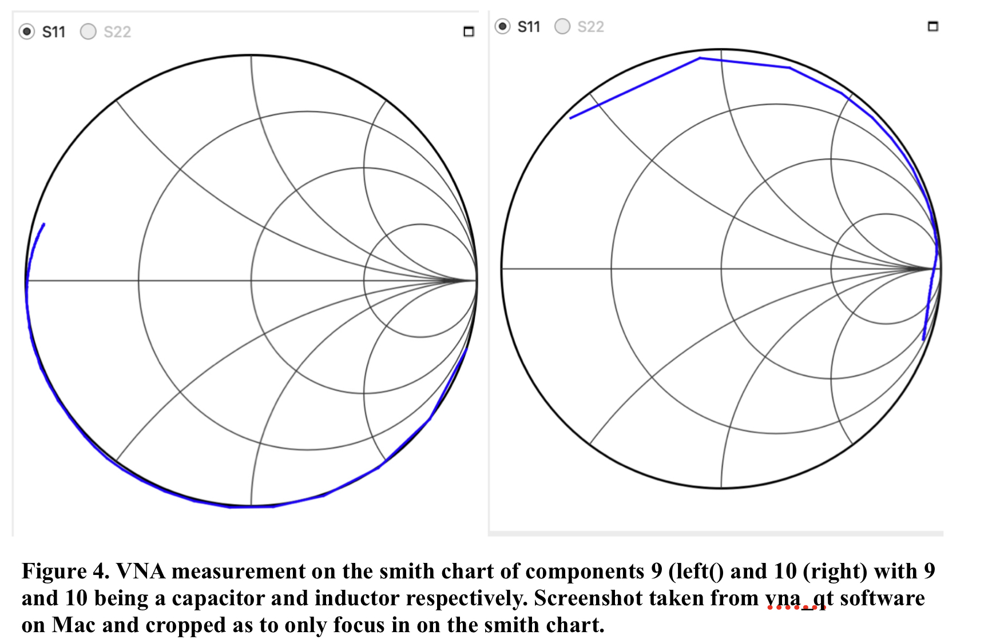
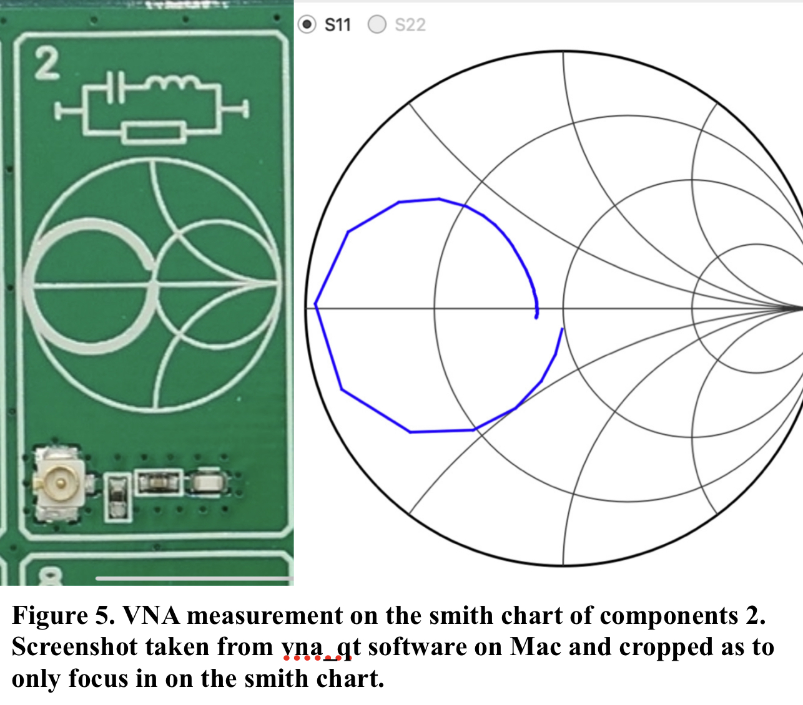
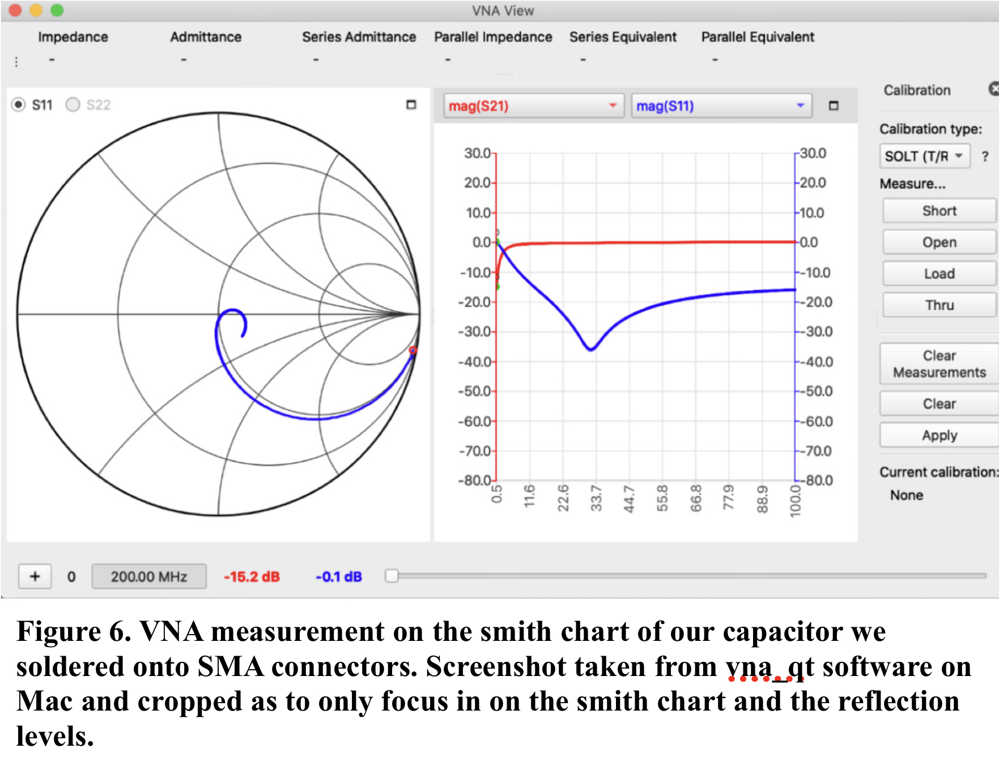
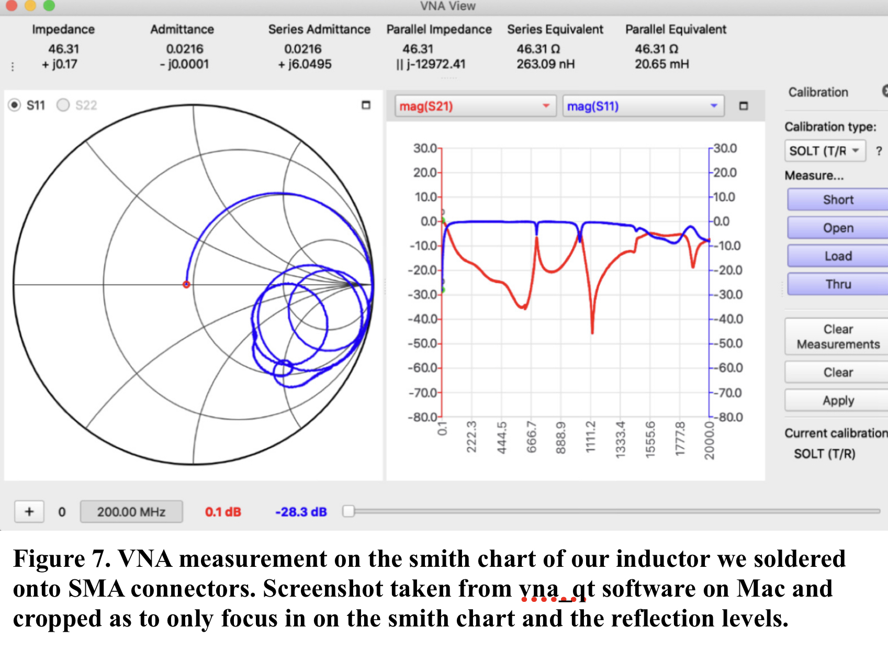
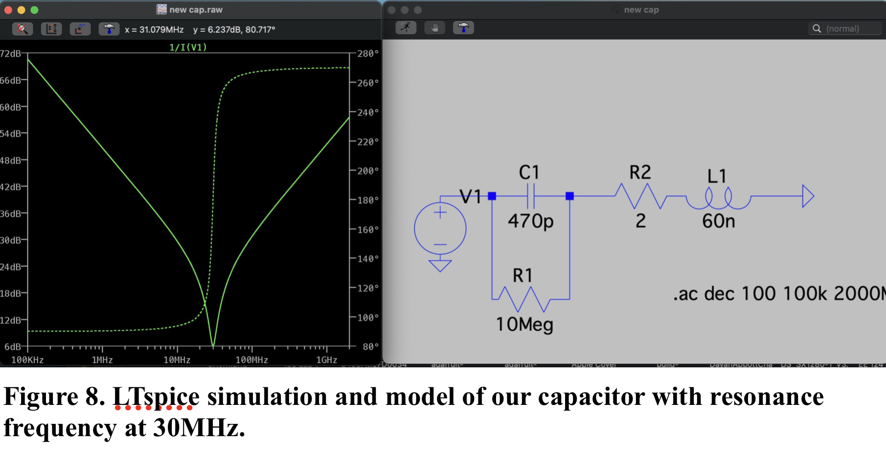
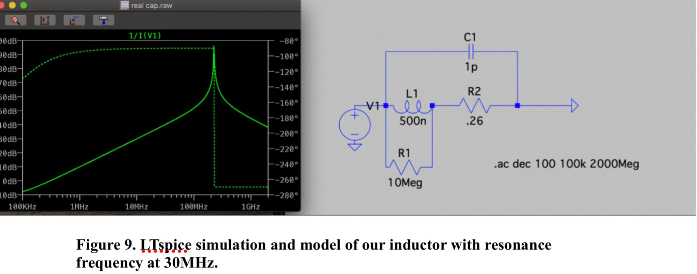

**EE 133: Intro to RF Systems Laboratory**

**Lab 1: The Secret Life of Passive Components And We meet a new friend, the VNA**

**Author: Marc Huerta**

**Lab Partners: Ben Clark and Devorah Simon**

                        Instructor:
                        Steven Clark
                        Lecturer
                        Electrical Engineering Department
                        David Packard Building, Room 112
                        350 Jane Stanford Way
                        Stanford, CA, 94305-9505
                        [steven.clark@stanford.edu](mailto:steven.clark@stanford.edu)
                        

**Abstract**

Modeling is a crucial step in the process of engineering whether the desire is to engineer a high precision measurement device or just a simple ‘gizmo’. Though it is not always the case that a model leads to perfect performance, better models provide a higher chance of success for the systems we design. Gaining experience with tools and lab instrumentation such as VNA’s is a step in working to build better models; with the VNA, measurements of parasitics on passive components becomes feasible. Thus in understanding these parasitics and how to use these instrumentations, one can then better model in simulation circuits they want to build.

**Introduction**

In our lab, students of the class were given a handout and objectives; among the objectives, they included understanding how to use a VNA (vector network analyzer) as a means to understanding realistic passive components. Mostly in classes, we assume everything to be ideal so viewing parasitics on a Smith chart meaningfully diverts the idea that components are anywhere near close to ideal in real situations. Familiarity with the VNA is of high importance so the first thing we focused on was getting acquainted with it and how useful this tool could be in helping engineers design better circuits and gizmos. I needed to know how to not abuse the VNA (not exceeding its capacities or abusing its ports by wearing them down), I needed to know how to calibrate a VNA (and why it’s necessary to in the first place), and finally wanted to know how to read and measure different components on a VNA. After doing this, the plan was then to use the VNA to get a better understanding of the physical components I had chosen and then model them more accurately (in software like LTspice) than their ideal counterparts.

**Experimental Setup**

To start, we were given mini-VNAs, specifically the NanoVNA2 Plus4 ( shown in **Figure 1**). These are small but relatively affordable VNAs that were accurate enough to get the important measurements we needed. Ease of use is important and with this miniVNA we were able to get that; there is open source software called vna_qt available to interface the VNA with our computer which allows us to view the VNA Smith chart and VNA data on our computers.

  

After getting the NanoVNA software downloaded and booted, we connected and powered on our NanoVNA to our computer to interface with the software. On the software, it gives us options for calibration and on the webpage for the software, it also shows us the steps for calibration. Within the given handout for class, it reminds us of SOLT (Short, Open, Load, Through) for calibration. All went smooth and with our connected wires and we calibrated the VNA successfully.

From then on we had our testing board which contained different passive components and filters. This was the RF demo kit board (shown in **Figure 2**). Having calibrated the VNA, we could then capture what these components looked like on the smith chart shown on the VNA.

  

The final part of the lab would consist of soldering two end-launch SMA connectors on opposite ends of the copper clad surface of a small rectangular piece of FR4. With the VNA, we then  measured (after recalibrating the VNA each time) to find the resonance frequencies of an inductor and a capacitor we had connected to the two end-launch SMA connectors. The VNA allows us to see the self-reflection from port 1 to 1 of the VNA which based on the component we measured (whether it be inductor or capacitor) should give us insight into the parasitics of a component.

**Measurements and Results**

While using the VNA to measure the components or filters on the RF demo kit, the measurements mostly were consistent with what the RF demo kit (**Figure 2**) said they should look. In this section, we’ll walk through notable components we captured.
The first measurement we’ll look at is that of basic resistors we measured from the RF demo kit as shown in **Figure 3**. Because real impedance values lie along the middle horizontal axis on a Smith chart, we expect for a basic resistor (with no reactive component) to lie along this axis when capturing its response on the VNA.

The captured measurement matches what **Figure 2** (components 3 and 4) has them down visually as on the board. We see here that it does sweep up towards being a bit inductive but this is due to parasitics from the board components as they are so close together but regardless, the imperfection of the resistor here is negligible compared to components like inductors that actually significant have reactance (which we will measure later in this section). On this resistor measurement, we swept from 0 to 200mHZ.
    
    

  

Before continuing, it is important to clarify more of the Smith chart. The Smith is a tool helpful in plotting impedance. Impedance can be both real and imaginary with the imaginary component of impedance referred to as reactance. As we discussed, components with no reactive element (resistors) span the horizontal axis as it’s a measurement of the pure real impedance. Yet we will see capacitors and inductors will span more beyond just the horizontal real impedance axis. Inductive reactive is what the upper half of the Smith chart plots and capacitive reactance is the lower half of the Smith chart. Respectively, this is where we expect to see both inductors and capacitors when we measure them on the VNA. The parasitics can be seen through the movement across frequency of these reactive components. If the legs of a capacitor are close together, as metal wires with current flowing through them, they act as inductors (with small inductance but enough to cause problems). Total reactance is the difference between Inductive and Capacitive Reactance (which is what the VNA plots onto the Smith chart output). When total reactance is 0, it means the imaginary component appears to be non-existent and only a real component of impedance remains. When the total reactance of an LC circuit is 0, this also means they are at resonance and on the smith chart, we should be able to see it hit the real impedance axis.

Now looking at the components with complex impedance, for these, the capacitor should span the bottom half of the smith chart and the inductor the top half as just aforementioned. We show these to be approximately what we measured in **Figure 4** as the inductor was a tad bit more un-ideal but this is a little more expected due to just the general build of an inductor and all the paratstics that inherently come from it more so than a capacitor. Inductors usually physically involve creating a coil to induce a magnetic field but as a result, the wires from the coil carry capacitance which makes an inductor more prone to act un-ideally.

  

Finally, the last of the RF demo kit VNA measurements are those of these reactive components in series and parallel. Looking at **Figure 5**, we see component 2 from the board. It is a capacitor and inductor in series in parallel with a resistor. As the frequency gets swept, it goes from being real impedance at low frequencies on the horizontal axis of the Smith Chart, then sweeps to being more capacitive until it meets its resonant frequency where the capacitive and inductance reactances sum to 0. Capacitor and inductive and energy is just oscillating between the 2 components at resonance and then finally ends up being more inductive as the capacitor acts more like a short at high frequency. 

  

Next we have what the individual components we measured were. These were the ones we soldered onto a copper plate with SMA connectors and then soldered the ends of the passive components to the middle connection of the SMA connector. We measured a capacitor first and this is what the smith chart for it looked like as seen on **Figure 6**. What we can gather here is that the self resonance frequency is at around 30MHz. How we see this is from the S11 blue measurement on the VNA display, we see at that frequency, a dip happens to around -35db. This means the circuit isn’t reflecting back as much as it was and instead is absorbing and dissipating energy out from itself as it does when it resonantes. This also looked as it should as we can see the resonance frequency here where it starts acting like an inductor for a little then goes back to being capacitive after crossing the resonance point.

  

For the inductor we got an ugly output. As stated previously, the inductor in real life is a high parasitic expected component due to the build of the inductor physically resulting in unintended capacitance. Looking at **Figure 7**, on this smith chart it shows there are two points where it resonates and acts as a capacitor for a duration of the frequency sweep as it dips and spirals into the lower bottom half of the smith chart. This is a result of the inductor as high frequencies acting like an open circuit and it directly goes towards the right side of the Smith chart ends (which measures how close the impedance is to a short circuit). After that point, the physical inductor coils take over and the capacitive properties of the coil wires take over. The set up soldered on the inductor too didn’t have the best insulation and protection from parasitics and we can see that on the chart. Yet still, it had its largest resonance frequency at around 111 MHz so this is what we’ll want to simulate later on.

  

Below on **Figure 8** is the spice simulation for the capacitor which we see goes downwards in its resonance and then goes back up as the capacitors allow high frequencies through. For this model, I had to tweak the inductance which I believe to be high because of the set up of the board and how close the plates and connectors all are to each other. Yet still, the simulation was able to get the peak at around a resonance of 30MHz as we got in real life.

  

  

The opposite is then true for the inductor which only allows low frequencies to pass so we see it go from allowing low db to peaking and allowing some frequencies through at its resonance frequency which we measured and then simulated to be around 110 MHz shown in **Figure 9**.

  

**Discussion**

In measuring the RF demo kit components,it was more controlled and less room for error so it makes sense why our outputs were closer to ideal. In the latter half of the lab, while measuring the capacitor and inductor values, we could more clearly see some nasty parasitics. To start, the chart on the inductor is very unideal (more so than expected at least as this was the first time seeing an inductor measured on a VNA). Yet, with simulations, we were able to still model the resonant frequencies. All in all, I do feel more confident in using a VNA to look at the behavior of components and then apply this gathered information to making better models.

**Summary**

All in all, the lab revealed a plethora of issues that circuit designers should be aware of when using the bigger components that are not SMD components. We were able to see first hand which components cause more parasticis and why circuit designers stay away from using inductors, especially the bigger ones which can carry more capacitance between their wrapped coils. In the end, this is just another tool to help our process as engineers and designers in a crucial step– modeling. Beyond that, by gaining familiarly with the VNA and parasitics of components as measured through the VNA, we become more informed engineers.
