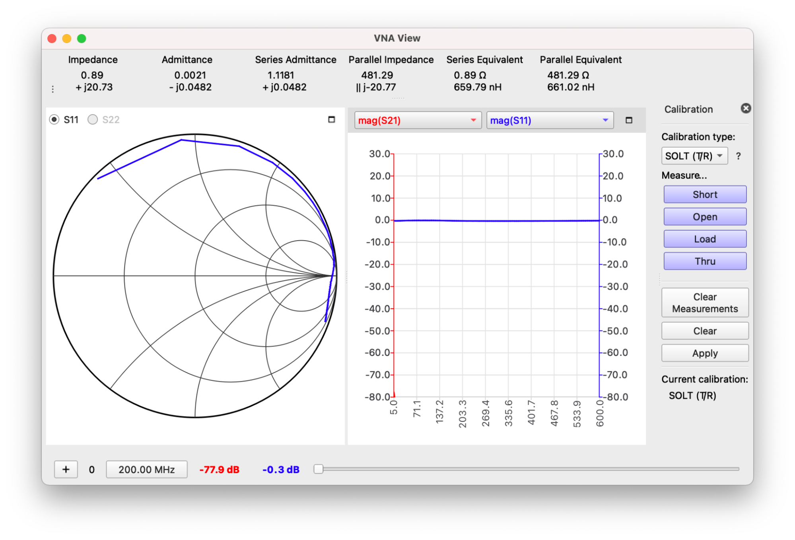
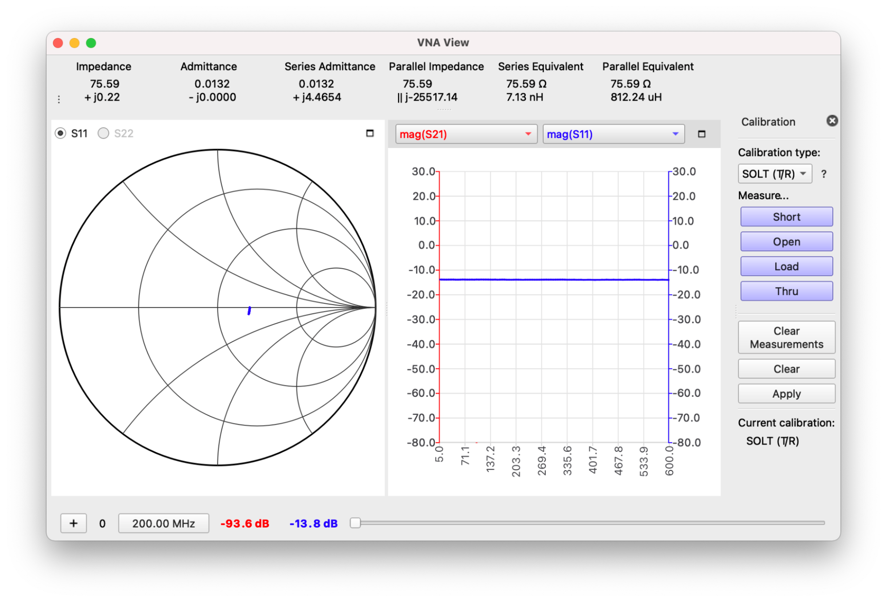
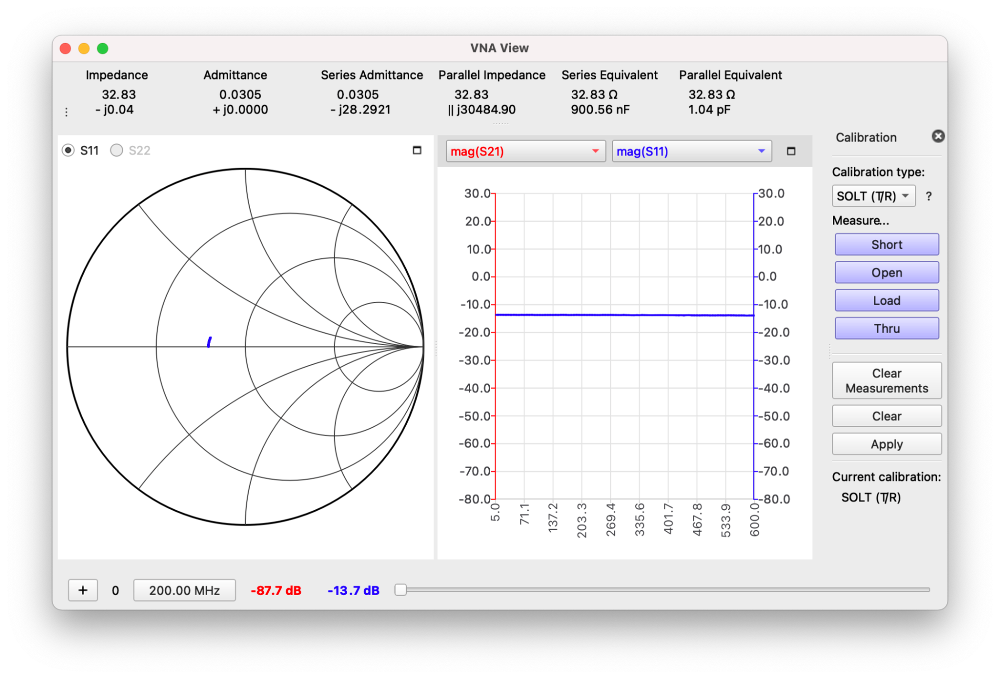
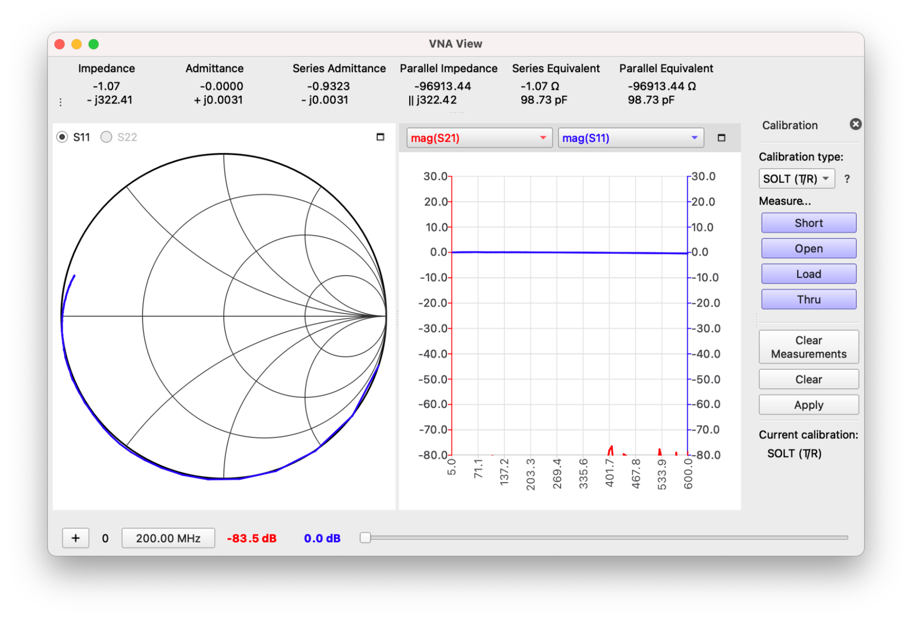
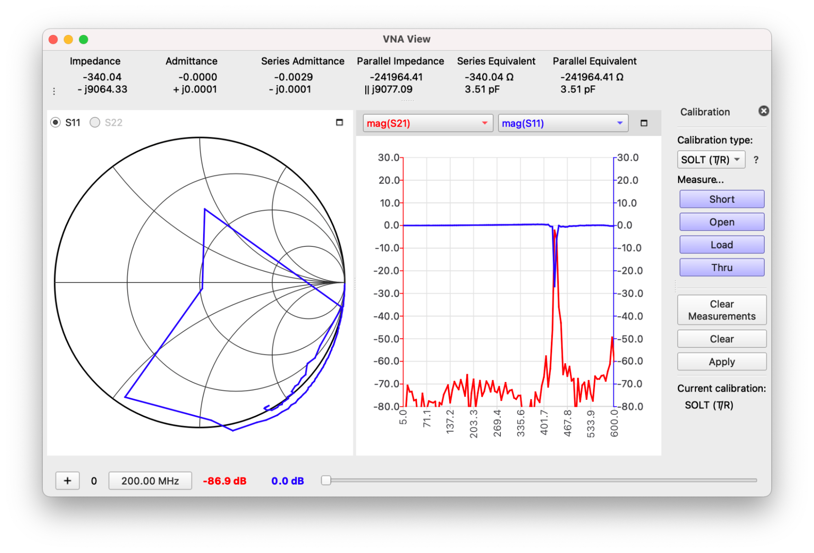
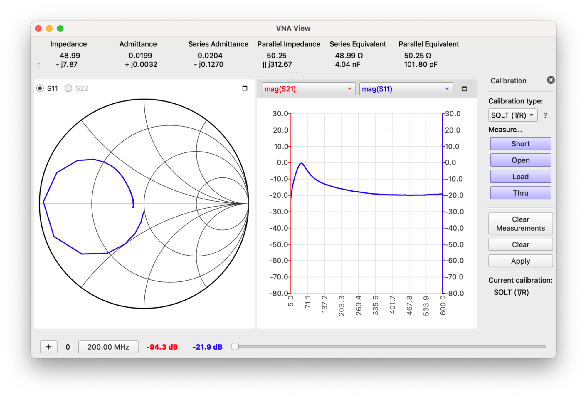
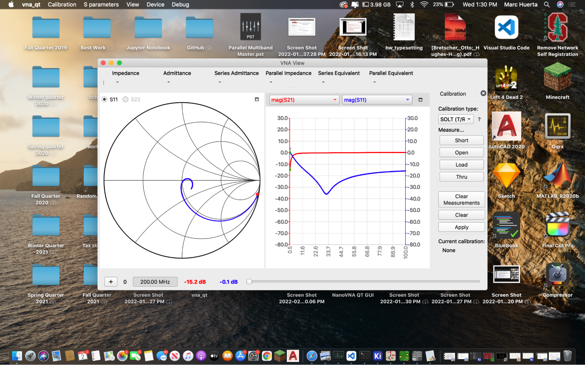
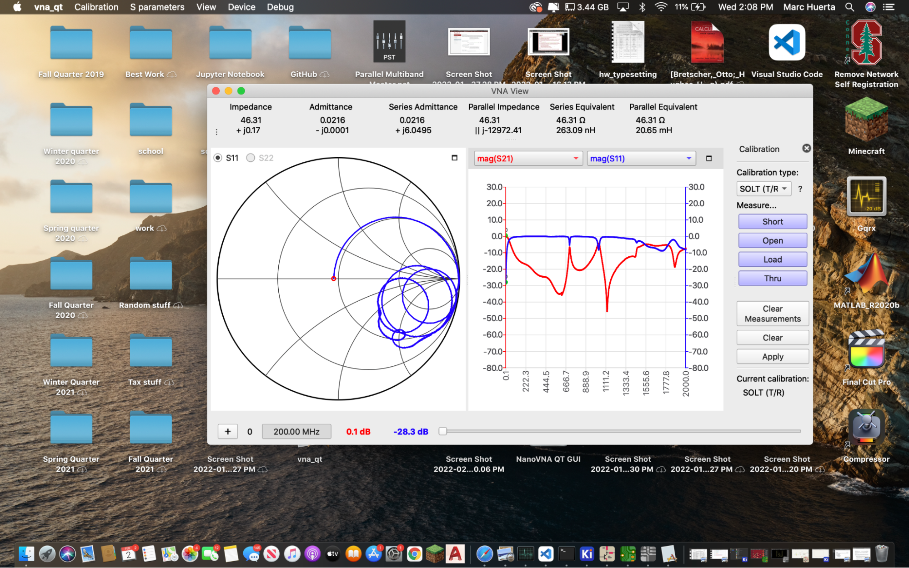
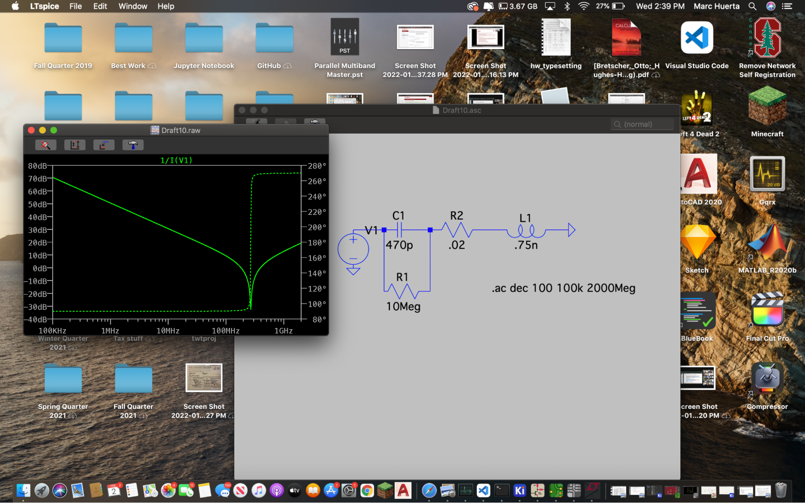
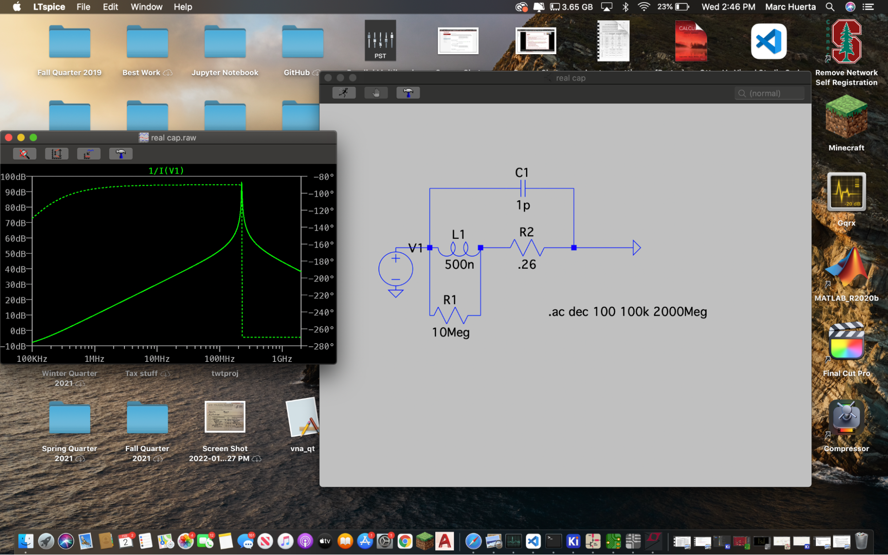

**EE 133: Intro to RF Systems Laboratory**

**Lab 1: The Secret Life of Passive Components**

**And**

**We meet a new friend, the VNA**

**Author: Marc Huerta**

**Lab Partners: Ben and Devorah**

                        **_Instructor:_**

                        Steven Clark

                        Lecturer

                            Electrical Engineering Department

                        David Packard Building, Room 112

                        350 Jane Stanford Way

                        Stanford, CA, 94305-9505

                        +1 650 723 1660

                        [steven.clark@stanford.edu](mailto:steven.clark@stanford.edu)

**Abstract**

Before the lab, I was rather unfamiliar with what a VNA was or what it really did so as the lab progressed, it was more so about figuring out how useful this tool is and what it tells us about components or things we’d like to measure. Among things learned relating to VNA’s, this lab taught me skills of how to not abuse the VNA (not exceeding its capacities or abusing its ports), how to calibrate a VNA and why it’s necessary, and finally how to read and measure different components on a VNA. While doing this, I simultaneously learned about passive components properties via the measurements displayed on the VNA and additionally through simulation on LTSpice.

**Introduction**

As the first real lab of the quarter, we were given a lab handout and were given instructions on what to do and objectives on what we should hopefully learn by the end of the lab. Among the objectives, they could basically be broken down into knowing and understanding how to use a VNA and then from there knowing and understanding the passive components we had in the lab via the VNA and simulation.  \
To start, we were given mini-VNAs and had to learn how to use these little VNAs. Specifically it was the NanoVNA2 Plus4 which are small but relatively affordable VNAs that were essentially ‘good enough’ to get most of the measurements we needed. The good thing about it was that there was software available to interface the VNA with our computer.

After establishing familiarity with our NanoVNA, we could move onto calibrating, then onto measuring, and finally reporting. This was the workflow taken over the course of the lab with the help of my 2 other lab partners as well.

**Experimental Setup**

The first part of the experimental setup consisted of firstly calibrating the VNA. After getting the NanoVNA software downloaded and booted, we connected and powered on our NanoVNA to our computer to interface with the software. On the software, it gives us options for calibration and on the webpage for the software also shows us what steps exactly to do for calibration. Within the lab handout as well, it reminds us of SOLT and how we should calibrate. First calibrate the short, open, load, and finally the through! All went smooth and with our connected wires, we calibrated the VNA successfully.

From then on we had our testing board which contained different passive components and filters. Having calibrated the VNA, we could then capture what these components looked like on the smith chart shown on the VNA.

Finally, for the last part of the lab, we soldered a copper ground plate to 2 SMA connectors and with the VNA measured and swept (after recalibrating the VNA of course) to find the resonance frequencies of an inductor and a capacitor. We could also see the reflection from port 1 to port 1 of the VNA which also tells us about the components and should match almost the opposite for th erhough (2 to 1) measurements.

**Measurements and Results**

For our results of the testing board that contained the passive components and filters, they were largely consistent for what the testing board said their smith chart should approximately look like. Below are photos of the components and filters we measured. \

     

    

    

For these results we see resistors lay across the middle line, capacitors span the bottom half of the chart, and inductors span the top half. There was nothing much out of the ordinary to note and everything went very nicely as it was supposed to according to what was shown on the pcb of components and the sith chart they said it should look like. Of course none of the components look exactly precise but they look very close.

Next we have what the individual components we measured were. We measured a capacitor first and this is what the smith chart for it looked like.

This also largely looked as it should as we can see the resonance frequency here where it starts acting like an inductor for a little then goes back to being capacitive.

For the inductor we got a little bit of an iffy/weird smith chart but since an inductor is a less ideal component, I just casted it away to that. On this smith chart, it appears there's really almost 2 points where it resonates and acts as a capacitor for a good chunk of the sweet as it dips and spirals into the lower bottom half of the smith chart.

Finally onto the LTspice simulation, we can see that what we simulated isn’t quite exactly what we measured in real life. In the discussion section we will discuss more as to why I believe this to be the case and how to fix it as well. Below is the spice simulation for the capacitor which we see goes downwards in it’s resonance and then goes back up as the capacitors allow high frequencies through.

    

The opposite is then true for the inductor which only allows low frequencies to pass so we see it go from allowing low db to peaking and allowing some frequencies through at its resonance frequency.

    

    **Discussion **

For the first part of the lab, everything was rather smooth, it was more controlled and less room for error so it makes more sense why that first part went smooth. When it comes down to the second part of the lab and measuring the capacitor and inductor values, then more problems come in with various things. First to start, the chart on the inductor is very unideal (more so than expected at least). Explanations for this could be lots of parasites due to how we soldered and measured on the inductor and also just the fact that inductors are just a very unideal component relative to capacitors. The other issues we came across were the simulations. If we do see the resonant frequencies for what we got and what was simulated, there’s a difference and I just chop it up to the modeling of the simulated passive components with added on simulation pseudo-parasitics to just not be very accurate in this case. I used values given in a practice simulation from the lab handout and quite frankly don't understand where the values came from but if we can better model them, I’d assume it’d be a bit close.

    **Summary**

All in all, the lab allowed me to work with VNA and passive components and get a chance to understand each respective one more via using the other other respective one and that goal was definitely achieved. I feel more comfortable understanding a VNA now and it is cool to see just how ‘unideal’ a passive component can be and how we do in fact get a 3 for 1 deal when it comes to passive components.
