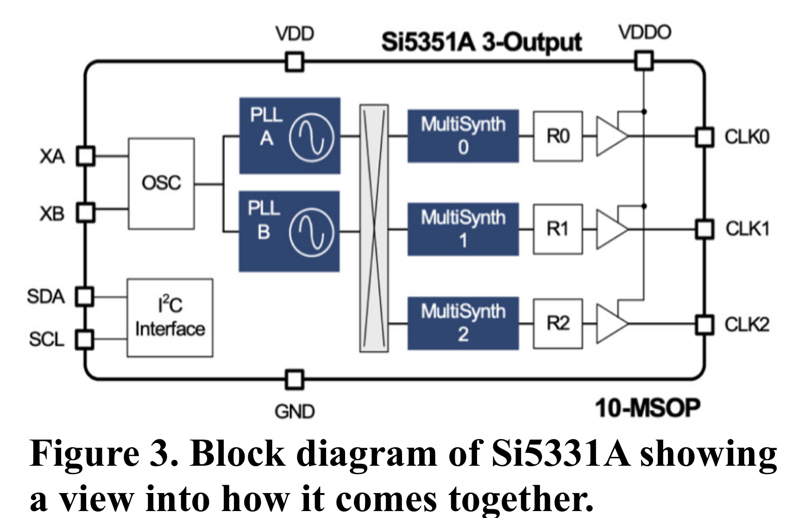

**EE 133: Intro to RF Systems Laboratory**

**Lab 2: Build An Oscillator, NOPE! Buy a clock generator, YUP!**

**Author: Marc Huerta**

**Lab Partners: Ben Clark and Devorah Simon**

                        **_Instructor:_**
                        Steven Clark
                        Lecturer
                        Electrical Engineering Department
                        David Packard Building, Room 112
                        350 Jane Stanford Way
                        Stanford, CA, 94305-9505

**Abstract**

Overall, to me this lab was most importantly about understanding the value of learning transferable skills in a lab/class setting. Reshaping the view I had on what the purposes of labs in a classroom setting were, in this lab I had the opportunity to work with a clock generator– namely the Adafruit Si5351A and using a microcontroller (the ItsyBitsy) to control it. While sounding simple enough on it’s own, I took away that practically, we don’t want to build everything from scratch nor is there a real reason to if that is not our domain of specialization; instead, let’s just take some hardware that has already been tested and is out there (better than any oscillator we could waste time building). Let’s also instead learn the skills it takes to do research on that piece of hardware, and – for example as we did in this lab – learn about any extra accessories (like a microcontroller) that are necessary to fully get the functionality we want out of a clock generator or in general, any hardware piece we want to integrate into a more general purpose gizmo we’d like to make. In addition to all that, while learning how to use the Si5351A, I was able to generally pick up a couple cool things about oscillators as discussed in the lab report.

**Introduction**

Firstly I will give a quick overview of my experience with the purposes of labs and what particularly about this one makes it an enjoyable one to complete. From my experiences in labs thus far in my academic career, a good chunk of them are made with the goal of not always learning and taking away skills that can be broadly applied in the future but rather with the goal of simply completing the lab and answering a couple lab questions. I bring this up because it is crucial to how I approached this lab differently than I would the traditional labs I’ve had. When told about the lab, it seemed relatively more broad than a structured traditional lab at first I’ve had in other classes but upon realizing that especially in this class, one of the primary goals is to take away _transferable skills _from the things we do and learn, it made me appreciate it more and gave me a better understanding of how to approach it.

Of course the goals still stood of actually understanding how to use a clock generator and even using an oscilloscope and VNA to see just how good of a clock generator it was; that was a large part of the report which I will be going over as well. Yet, in this introduction I did want to emphasize the skills I gained as a result of getting to that point and the understanding I gained from having to dig through websites and pages to find information/code I needed to be able to run the clock generator through ItsyBitsy. More of the technical discoveries I made will be shown in the latter parts of the report such as investigating a bit on how the clock oscillator works internally on a high level and looking at how we can tell when the clock generator works best.

**Experimental Setup**

To begin, I’ll list out the 2 main physical pieces of hardware we were given to start this lab. Firstly as already mentioned, we were given a Adafruit Si5351A Clock Generator Breakout Board and secondly we were given an Adafruit ItsyBitsy M4 express. Of note right away is that they are both parts made by Adafriuit so the hope with this off the get go is that the ItsyBitsy will have some sort of support in the form of code library to help us interface face with the Si5351A (which is indeed the case). To recap this first step, we just got these 2 pieces of hardware and soldered on some SMA connectors onto the breakout board as well. We then with some jumper wires connected the corresponding pins from the breakout board to the microcontroller and double checked on the breakout board documentation if these were the correct pins to connect the board to. The put together board can be seen here in **Figure 1.** 

After getting the hardware setup on the board, we moved onto using the microcontroller to interface with it. To do this, that is where a bit of the transferable skills of self research into a manufacturers websites came in handy. Though we were given a good starting point from our instructor as to the links to look towards, it still took a bit of digging to find what we needed. To summarize quickly what we did to get set up with the software side of things:

* We first download the recommended editor to interface with the ItsyBitsy which is the Mu Editor in this case
* We then read documentation on how to load up the ItsyBitsy by updating the bootloader on the ItstyBitsy and then installing CircuitPython onto it which allows us to use the necessary libraries we’ll need to control the clock generator as we please.

After doing all these steps and sifting through various libraries to download and run the clock generator with ease, we got to this point as shown in **Figure 2** where we had editable code and could run 3 different clock frequencies on the breakout board!

**Measurements and Results**

Before we can formulate more specific questions, the first and most important question to start measurements off with is “does this work” and then possibly even more importantly ask “does this work well… if not, then why?”

To start with the cleanest output we got, we refer to clock 2 running at 10.7KHz as we see in **Figure 2**, the bottom of the screen is the serial output which is coded to show us frequencies each clock is running at. Here is a good point to form a basis of how internally the Si5351A does this at the level of a block diagram. Shown below in **Figure 3.** Essentially what the code does is it sets each PLL (both A and B) to a multiple frequency of the onboard 25MHz reference crystal. Within the PLL part of the diagram, there is some internal multiplier that does this and with the arduino and I2C interface, we can set the multiple of the local reference oscillator we want the PLL to be set to. Then for the clock output, it divides this intermediary frequency using fractional dividers which essentially just means it can divide this intermediary frequency fractional by a divisor of 1MHz to 100KHz. The range on an output of a clock is said by the manufacturer to be 160Mhz to as low as 8KHz.

A good clock oscillator looks ideally like a perfect square wave. We do know that due to the fact we can’t have infinitely summed high frequencies, there will be imperfections in a recreated square wave, usually some sort of Gibbs phenomenon which leads to peaking at the rising edge of the clock and at the falling edge. Now we look at **Figure 4** on the left hand side, we can see that the 10KHz clock signal on the oscilloscope looks pretty good like a square wave with some of that gibbs phenomena discussed. On the right hand side, we see a measurement on the VNA (this picture taken courtesy of my lab partner Devorah Simon). We see there is relatively low noise surrounding the signal as well. 

Going into the 13MHz clock, we start to see both more noise on the spectrum and see the square wave start to look a bit uglier and imperfect. This is caused by several reasons. First of all (by my own doing and to my demise) I used a probe to measure the clock generator output, which after researching about it, seems it had some unintended consequences of adding extra unwanted capacitance to the singal I read. As a result, this extra capacitance forms a low-pass filter which filters out high frequencies and hence, makes the square wave look uglier at higher frequencies. The probe also has limited bandwidth lower than the oscilloscope which has a bandwidth of 500MHz so this could also contribute. Below in **Figure 5,** is a set up of my probe (left) along with the measured 13MHz clock signal (right)

Finally for our last measurement, clock 0 is the output of the clock generator breakout board. Again there was much noise gathered here that made the signal look bad as it did for the 13MHz one. Comparing the noise floor on the VNA of the 10KHz clock and this 112MHz clock, we can see a lot more phase noise as the peak is more broad as well in **Figure 6 **and the SNR is lower than it was in the 10KHz spectrum**.** The amount of noise we can see here compared to the 10KHz signal indicates to me that it is not a low noise part.

**Discussion**

After discussing some of the results already in the previous section, I wanted to briefly discuss some of the possible applications. In trying to do this, I was reading through data sheets as I’ve found they usually tell you good applications on there because they want you to use it and want you to buy the part. Though what I found was a bit disappointing. From the top of my head, the things I thought it’d be useful for was that it could generate synchronous signals and asynchronous signals as well. The synchronous signals would be good for a PLL and also being able to have a running reliable clock could eliminate the need for a general oscillator or VSCO depending on your application. THis is where I realized I don’t and haven't really had an application for a PLL or oscillator in the work I’ve done so I’m as a result, looking further into what I can do with PLL and learning more about it. I was hoping the datasheet would tell me some more specific applications but it essentially was very broad and stated what I already knew it could do and be used for but in a very broadly disappointing way.

**Summary**

All in all, this lab helped me understand the skills necessary to set up a tool and read through pages of websites to ultimately in the end, make it easier for myself to do something  I want and avoid 1. Building a piece from scratch (like an ossocialtor) and 2. Writing code from scratch for hardware I’m unfamiliar with. Along the way, I also got to keep working with oscilloscopes and VNAs and through testing (and some errors) picked up some tidbits of knowledge and understanding which will be useful going forward. Again, these are practical skills that I can now transfer and have since transferred as well when working on my final project, I had to do similar things finding hardware, and available software interfaces to save me a lot of time building something that already exists.
