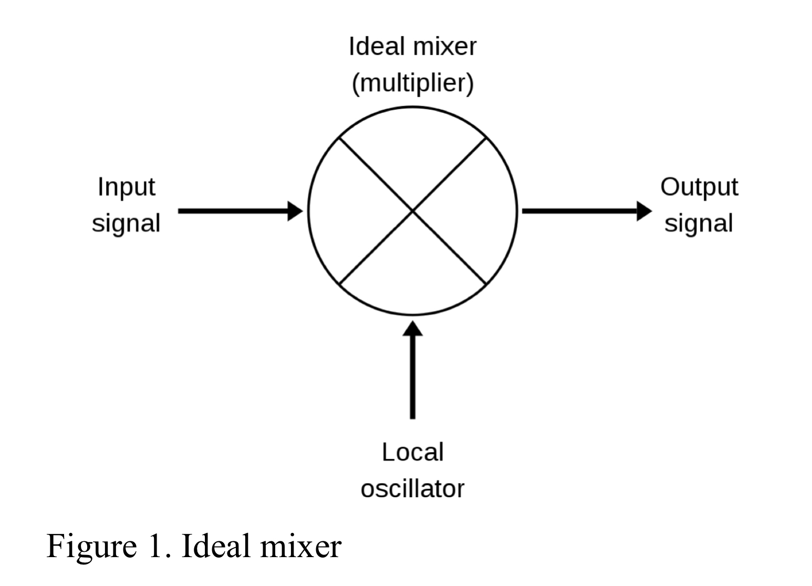
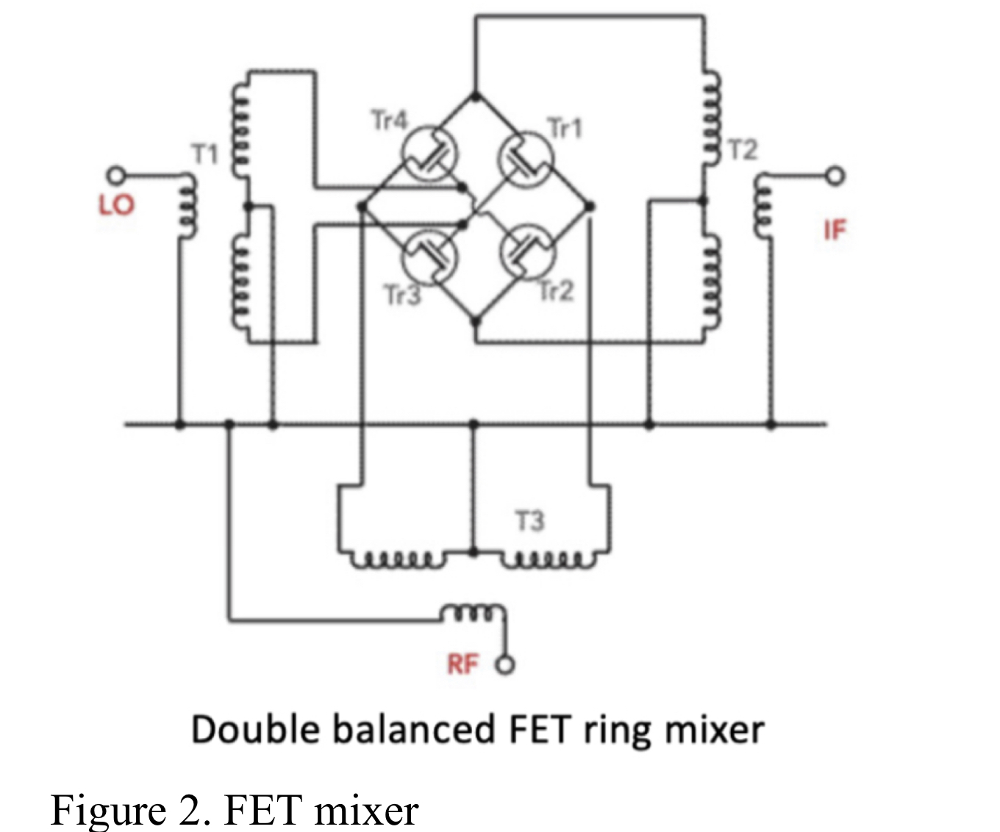
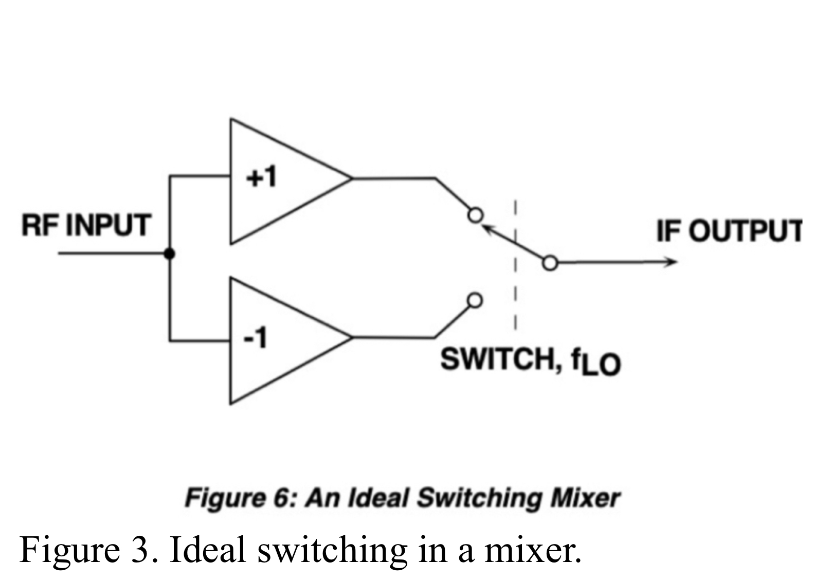
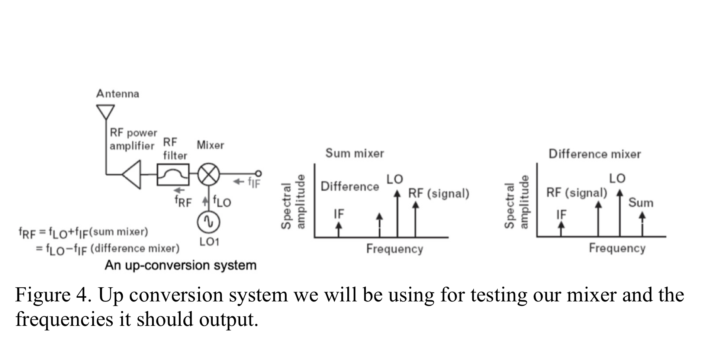
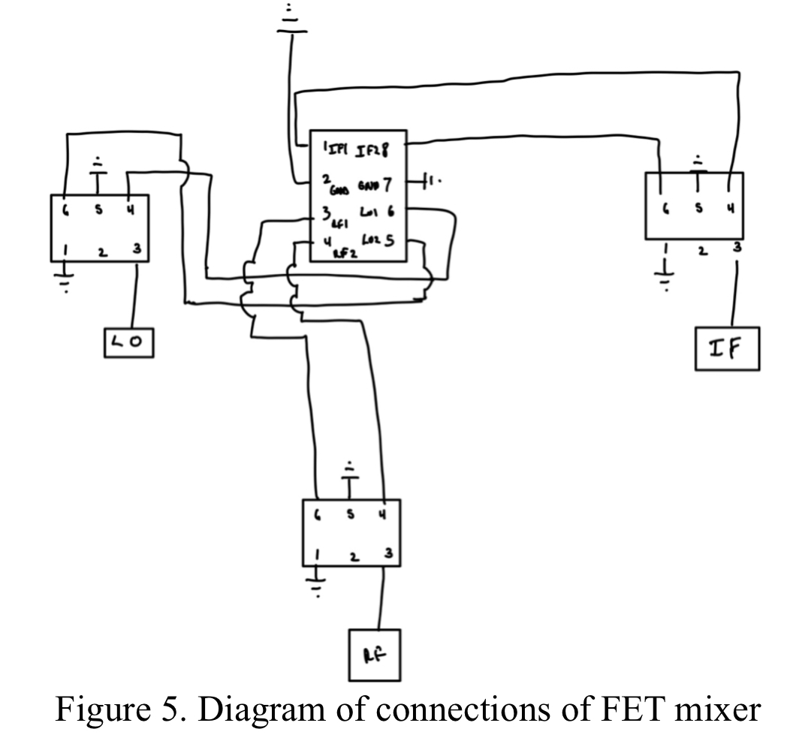
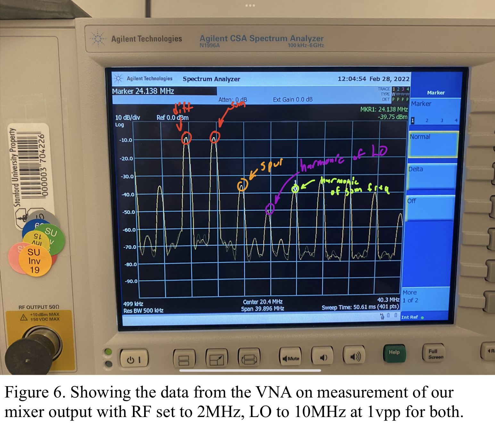
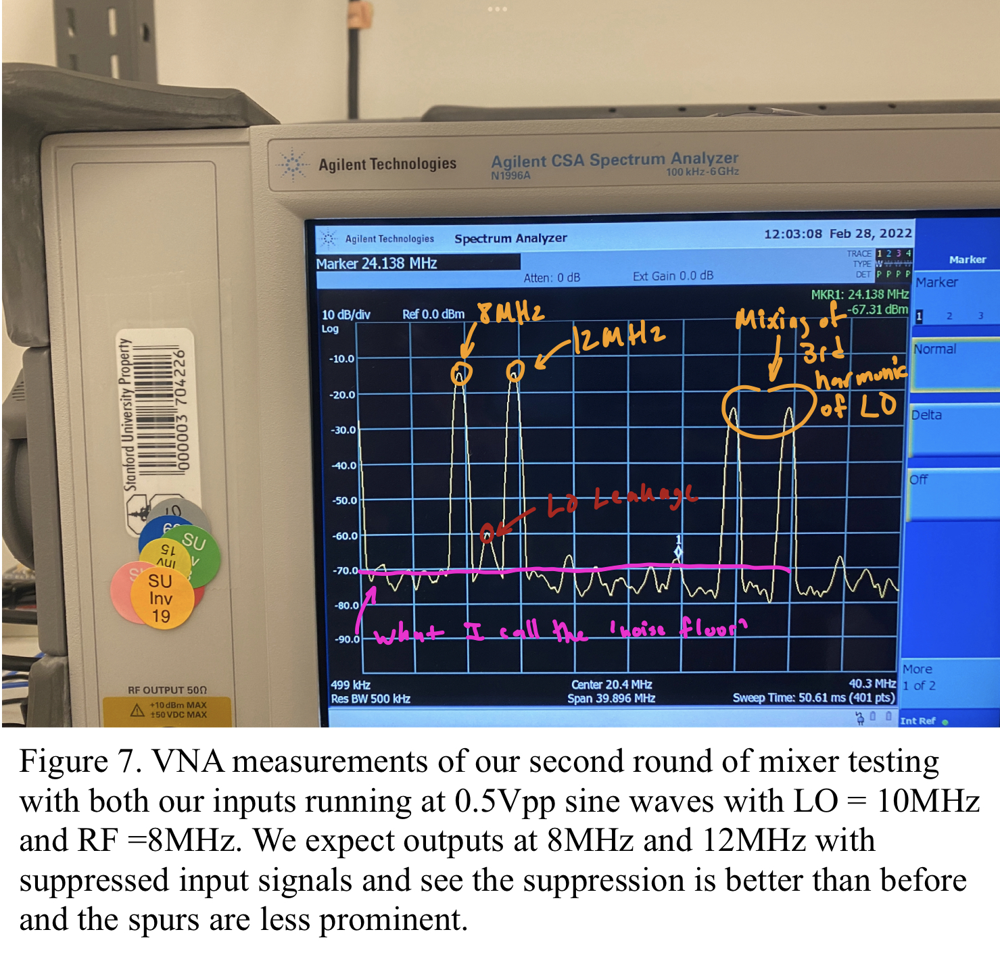
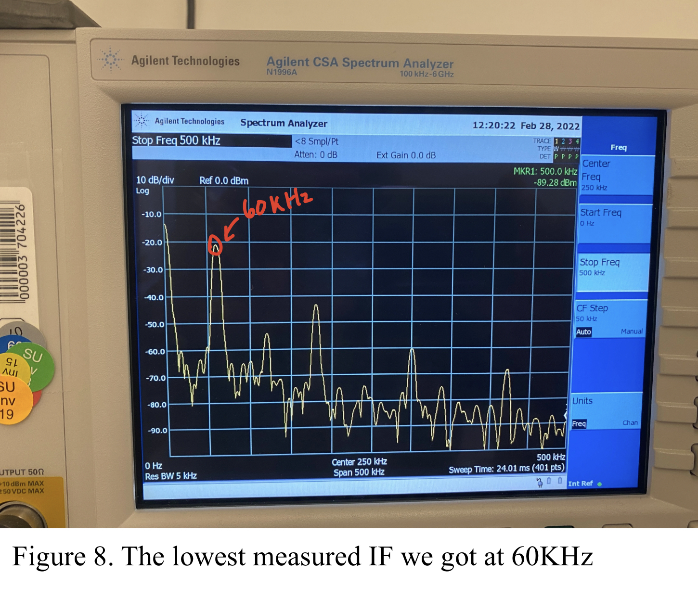

**EE 133: Intro to RF Systems Laboratory**

**Lab 3: Sir Mix-a-Lot**

**Author: Marc Huerta**

**Lab Partners: Ben Clark and Devorah Simon**

                        Instructor:
                        Steven Clark
                        Lecturer
                            Electrical Engineering Department
                        David Packard Building, Room 112
                        350 Jane Stanford Way
                        Stanford, CA, 94305-9505

**Abstract**

In this lab, we got a chance to learn and construct a mixer– a device that produces two frequencies based on the sum or difference of two input signals. Often known by many names such as a demodulator, multiplier, synchronous detector, and many more, this lab resulted in a learning of various performance measures, specifically a MOSFET mixer. Among the measures, we measured and discussed the 1 db compression point, the LO (local oscillator) leakage, conversion gain from the output vs the LO input, and spurs which are unwanted frequencies our mixer produces as a result of it mixing leakage currents from the inputs. We also discussed what the lowest IF frequency we could get out of our mixer and found out why our MOSFET mixers cannot mix down to DC.

**Introduction**

Mixers are an underappreciated tool used to work with signals in a variety of ways – commonly come across by EE students as a giant X symbol (as shown in **Figure 1**) when modulating or demodulating signals in signal processing.

  

Working to demystify and understand better how this device works, this lab goes through the steps of building one of many various types of mixers called a Double Balanced FET ring mixer shown in **Figure 2**. 

  

In getting to understand our measurements on our built RF mixer we will produce at the end of this lab, we must first give a quick review of how mixers work _ideally_. RF mixers are passive devices meaning that just with the input signals they receive, they produce an output signal with no additional power being supplied to the device. Our FET mixer works by switching which is why these types of mixers are also called sampling mixers. An ideal model shown in **Figure 3** breaks down how the ideal sampling mixer switches between +RF input and -RF input at a frequency of LO and this sampling creates the IF output. 

  

Additionally, mixers have the power to create frequencies higher than their inputs (called up-conversion) and create frequencies lower than their inputs (called down-conversion). For the mixer we are building, we will be focusing on measuring an up-conversion system of the mixer. Shown in **Figure 4**, this mixing system produces two output frequencies; one ideally at the sum of the two input frequencies and the other at the difference of the both and should suppress the two input frequencies. The keyword for this part being “ideally” and the resulting sections will go on to show how different the actuality of a mixer can be from the ideal.

  
  

**Experimental Setup**

To measure anything, we must first build the mixer. This consisted of just four IC components along with three two end launch SMA connectors which were all soldered onto a FR-4 copper clad piece that already had through holes on it. The first IC component is the PE4141-51 which is just the middle FET ring part of the mixer as shown in **Figure 2**; the middle FETs ring is composed of 4 MOSFET transistors of which two are on at a time and they switching at the frequency of LO to either output +1 RF or -1 – working in principal, the same as the ideal switching mixer in **Figure 3**. The other 3 parts are ADT4-1WT transformers which are also seen in **Figure 2**. The circuit we then build after reading the data sheet and finding the correct pinout connection models is exactly as seen in **Figure 2** as well. The sketched schematic is shown below in **Figure 5** which shows the pin connections from each IC.

  

After building the mixer, we were all set up and ready to start testing our mixer. By testing, we want to get a measure of how good our mixer is and to do this, we must understand what even a “good” mixer should do. As described earlier, an ideal mixer in an up-converting system should only output a sum frequency of its two inputs and the difference frequency between the two input frequencies while suppressing the input frequencies and ideally any harmonics. An ideal mixer also has a linear conversion loss of 1 meaning what you put in for RF, is what you get out of LO in dBm. A measure of how ‘good’ a mixer is turns out to be just a list of terms and concepts that measure how much a mixer deviates from its ideal.

Firstly, as a measure of performance on our mixer, we’ll look at conversion gain from RF into LO out, we’ll also look at LO leakage (how much of our LO leaks through – which again, ideally none of leaks through), and finally look at the 1db compression point (which we’ll be discussing in the next section). Aside from these measures of performance, with the VNA, we can visually see imperfections in our mixer as well such as ‘spurs’ which are a result of the mixer mixing all signals (such as harmonics of input signals). 

**Measurements and Results**

To start our measurements section, let’s focus first on what our mixer does right. Setting LO to be a 4Vpp 10MHz sine wave and RF to be a 4Vpp 2MHz sine wave, we get the results shown in **Figure 6**. What looks good here is that our two signals we want (the sum and difference of the LO and RF frequencies), are the strongest signals we see in dBm. What else is good is that we measured the gain of the LO to be ~= -50 dBm which means we are suppressing our LO very well and our RF is at ~= -20 dBm compared to its input 16dBm which also means it’s getting suppressed pretty well. Notably, the conversion gain is about 17 dBm which is poor conversion meaning we’re getting about 1/7 the input power out.

  

In the figure above, we just methodically wanted to see if our mixer was mixing at all but as a result, we also didn’t run it at its optimal operating point; to make the mixer work better and have a better output, let’s fine tune our inputs to a dBm/Vpp that reduces noise, spur magnitude, and harmonic distortion. As our first check, let’s go low power/sine wave amplitude on our inputs. Setting both our RF and LO to run at the same frequency but now at 500mVpp or roughly -2 dBm, **Figure 7** shows our results. Notably, there is much less ambient noise as the noise floor is lower (a term I use to describe the lowest dBm spectrum surrounding the frequencies we care about). We still see about a 11 dBm gap between the input RF and output IF as the IF outputs here are around -13 dB with input at -2db showing a conversion gain of roughly 0.28 up double from 0.14 conversion gain of our previous measurement which is an 100% conversion gain improvement. Our LO leakage is at around -60 dBm and all other spurs as well peak way less (have less power) than in our previous measurements. Based on our knowledge of how to measure the performance of a mixer, this current operating point in **Figure 7** works marginally better than the first measurement. 

  

One of the last measurements to look at for our mixer is called the ‘1 db compression point’. This compression point is based on the deterrence of linearity from the RF input to the IF output and finding out at what input dB does the IF output start to lose its linearly proportional relationship to the RF input. For the purpose of not flooding this report with photos, we will first here talk about measurements made before coming to any conclusions on them. To try and find the 1dB compression point, the first method at approaching this was based on visually ‘eyeballing’ the spectrum of the IF output on the VNA. We had noticed already that as we slowly turned the dBm down or up our input RF signal, the dBm of our IF output seemed to linearly follow with a gap of about 11 dBm of power between them constantly (a conversion gain of about 1/3). The goal here was to tune the dBm of the input RF up (from a low starting dBm) and visually notice when the IF dBm stops increasing linearly with it. This was done while the LO was set to 1Vpp (4 dBm). Starting the RF at 250mVpp (-8 dBm), we increased the dBm slowly and visually, we were able to notice that around 7dBm (1.4Vpp) the relationship stopped being linearly and the gap between input dBm and output dBm grew out of that 11 dBm gap between the RF signal and IF signal meaning the conversion gain got worse. From our knowledge of compression points as well, we know that it is relative to the LO power level as well so in this case, since the LO is at 4 dBm, the 1 dB compression point is about 3 dB higher than our LO. This is an important performance metric for mixers because they tell us how powerful (relative to our LO), our RF input signal could be for us to still get good conversion gain. 

**Discussion**

A couple things were left untalked about in our measurements and results section, of which first I wanted to talk about the how in **Figure 7** specifically, there were 2 other high dBm frequencies besides the expected ones. As described earlier, spurs are the result of the mixing of the harmonics of the input frequencies into RF and LO because mixers mix all input signals. This spur is the result directly of the mixing of the 3rd harmonic of the LO and the RF signal which results in these prominent frequencies at 28MHz and 32MHz. Spur frequencies (Fspur) can be predicted by the simple formula at Freq of spur = m*Freq of RF + n*Freq of LO for all m,n that don’t equal 0. In the measurement in **Figure 7**, we see m = 1 and n = 3. This formula also explains the various spurs we see mostly arising at even frequencies and every 2MHz or so throughout mostly all our measurements.

Another question that arises out of our measurements and curiosity is how low can our output IF frequency go; so our system, this means asking the same question as ‘what’s the smallest difference between RF and LO frequencies before LO becomes too weak or just completely gone.’ I ask what the lowest frequency is because we know it cannot reach DC as a result of the transformers we use being coupled so no DC should pass through to the output. If you wish to make a mixer that does go down to DC, we’d have to use something akin to a fully differential op-amp which can pass DC. A common application of a mixer is also in a phase locked loop (PLL) but to use it in a PLL, the mixer must be able to go down to 0Hz so in that application of a mixer, we would not be able to use the one we made. So again, the question arises of how far down low in frequency can we output out of our IF? From our measurements, we got (though with poor conversion gain) IF to go down to about 20KHz before it just completely disappeared into the ‘noise void’. With still decent amplitude (roughly 20dBM) and a conversion gain of about 1/10th, we got a better signal at 60KHz and we show this measurement below in **Figure 8.**

  

Additionally, I will discuss why we picked some of the measurement values we did. For example, the RF and LO input frequencies were 2MHz and 10 MHz respectively; this was a bit arbitrary but the idea behind this combination was so the spacing of all the signals (wanted) and spurs (unwanted) we’d be able on the VNA which made it easier to explain things like spurs since in this set up, we’d have spurs mostly in intervals of 2MHz. Another thing we focused on was using our mixer as strictly an up-converter; this was more so done to just focus in one a system that I believed to be more interesting via personal preference and also one that was more than suffice to be able to learn and understand more about the mixer we built. 

**Summary**

We started this lab with the goal to build our own mixer and then via the VNA, learn more about our mixer’s performance and overall learn more about mixer’s in general. In order to achieve these goals, we looked into how we can measure performance on mixers and found good performance checks to be done by investigating measurements such as the LO leakage, conversion gain, and looking into unwanted frequencies at the output (spurs). Additionally in our discussion section, we went over why we got some of the measurements we did, why we used the measurement inputs we did, and reviewed some questions arising from our measurements such as asking how low can our output IF go.

