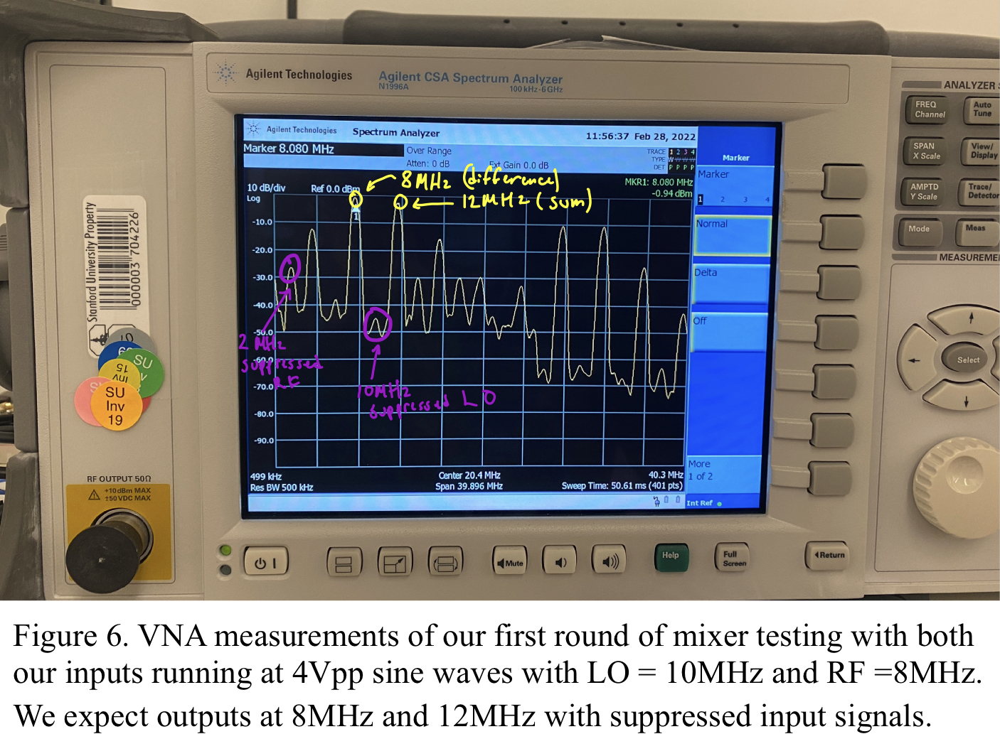

**EE 133: Intro to RF Systems Laboratory**

**Lab 3: Sir Mix-a-Lot**

**Author: Marc Huerta**

**Lab Partners: Ben Clark and Devorah Simon**

                        **_Instructor:_**
                        Steven Clark
                        Lecturer
                            Electrical Engineering Department
                        David Packard Building, Room 112
                        350 Jane Stanford Way
                        Stanford, CA, 94305-9505

**Abstract**

In this lab, we got a chance to learn and construct a mixer– a device that produces two frequencies based on the sum or difference of two input signals. Often known by many names such as a demodulator, multiplier, synchronous detector, and many more, this lab resulted in my learning of various performance measures, specifically a MOSFET mixer. Among the measures, we measured and discussed the 1 db compression point, the LO (local oscillator) leakage, conversion gain from the output vs the LO input, and spurs which are unwanted frequencies our mixer produces as a result of it mixing leakage currents from the inputs. Additionally, we discussed what the lowest IF frequency we could get out of our mixer and found out why our MOSFET mixers cannot mix down to DC.

**Introduction**

Mixers are an underappreciated tool used to work with signals in a variety of ways – most commonly as I’ve come across them is as a giant X symbol (as shown in **Figure 1**) when modulating or demodulating signals in signal processing. 

Working to demystify and understand better how this device works, this lab goes through the steps of building one of many various types of mixers called a Double Balanced FET ring mixer shown in **Figure 2**. 

In getting to understand our measurements on our built RF mixer we will produce at the end of this lab, we must first give a quick review of how mixers work _ideally_. RF mixers are passive devices meaning that just with the input signals they receive, they produce an output signal with no additional power being supplied to the device. Our FET mixer works by switching which is why these types of mixers are also called sampling mixers. An ideal model shown in **Figure 3** breaks down how the ideal sampling mixer switches between +RF input and -RF input at a frequency of LO and this sampling creates the IF output. 

Additionally, mixers have the power to create frequencies higher than their inputs (called up-conversion) and create frequencies lower than their inputs (called down-conversion). For our mixer we are building, we will be focusing on measuring an up-conversion system of the mixer. Shown in **Figure 4**, this mixing system produces two output frequencies; one ideally at the sum of the two input frequencies and the other at the difference of the both and should suppress the two input frequencies ideally. The keyword for this part being “ideally” and the resulting sections will go on to show how different the actuality of a mixer can be from the ideal.

**Experimental Setup**

To measure anything, we must first build the mixer. This consisted of just four IC components along with three two end launch SMA connectors which were all soldered onto a FR-4 copper clad piece that already had through holes on it. The first IC component is the PE4141-51 which is just the middle FET ring part of the mixer as shown in **Figure 2**. The other 3 parts are ADT4-1WT transformers which are also seen in **Figure 2**. The circuit we then build after reading the data sheet and finding the correct pinout connection models is exactly as seen in **Figure 2** as well. The sketched schematic is shown below in **Figure 5** which shows the pin connections from each IC.

After building the mixer, we were all set up and ready to start testing our mixer. By testing, we want to get a measure of how good our mixer is and to do this, we must understand what even a “good” mixer should do. As described earlier, an ideal mixer in an up-converting system should only output a sum frequency of it’s two inputs and the difference frequency between the two input frequencies while suppressing the input frequencies and ideally any harmonics. An ideal mixer also has a linear conversion of 1 loss meaning what you put in for RF, is what you get out of LO in dBm. A measure of how ‘good’ a mixer is turns out to be just a list of terms and concepts that measure how much a mixer deviates from its ideal.

Firstly, as a measure of how good it is, we’ll look at conversion gain from RF into LO out. We’ll also look at LO leakage (how much of our LO leaks through – which again, ideally none of leaks through). Another measure is the 1db compression point and the last one we’ll look at is the number of spurs in our results. 

**Measurements and Results**

For our measurements we recorded in the lab, we set the LO to be 10MHz and the RF to be 2MHz. **Figure 6** shows what I recorded from my mixer. Here we can see the difference and sum frequencies at 8MHz and 12MHz and they have good amplitude relative to the rest of the harmonics and spurs we see. We see spurs at combinations of the sum 2 input frequencies so here we can see one at 14MHz. We can also see the harmonic of the LO still persisting at 20MHz.

**Discussion**

After measuring the data from the VNA and visually seeing seeing the two frequencies we want change when adjusting the amplitude of the RF, we found the 1db compression point to be about 1.2Vpp because this is when we observed it stop being linear to the input gain we put in and start sloping in a logarithmic relative to the increase of the RF voltage. We also went down and measured the minimum IF frequency which we got to be around 40Khz shown in **figure 7** with a loss conversion of around -20db. At 20 Khz IF, the loss conversion was -40db.

**Summary**

After going through and building our very own mixer and using the VNA to measure the various measurements that make us consider a mixer to be ‘good’, we got a better understanding of how a mixer works in practice, why they are unideal and where it comes from, and how they perform in real time.
